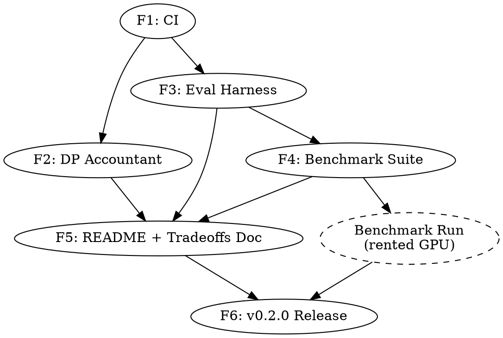

# Chorus Phase 1 — Execution Plan

> **For agentic workers:** REQUIRED SUB-SKILL: Use superpowers:subagent-driven-development to dispatch fresh subagents per feature, each in its own git worktree, opening one PR per feature. This document is the master execution plan; each feature has (or will have) its own bite-sized implementation plan in `docs/superpowers/plans/`.

**Goal:** Ship Chorus v0.2.0 — close the marketing-vs-substance gap from v0.1.0 by adding a real-data benchmark suite, a proper DP accountant, CI, and honest documentation.

**Architecture:** Six independent features, each developed in its own git worktree on its own branch, opening one PR each, tracked by one GitHub issue each. Features 1, 2, 3 can be developed in parallel after Feature 1 lands; Features 4, 5, 6 are sequential. Each feature has its own detailed bite-sized plan, written just-in-time before that feature starts.

**Tech Stack:** Python 3.10–3.12, FastAPI (existing), PyTorch + safetensors (existing), HuggingFace `datasets` + `evaluate` + `peft` (new for eval), Google `dp-accounting` or `opacus.accountants` (new for DP), GitHub Actions (new for CI).

**Spec:** `docs/superpowers/specs/2026-05-19-chorus-phase-1-credibility-design.md`
**Roadmap:** `docs/superpowers/specs/2026-05-19-chorus-roadmap.md`

---

## 1. Feature breakdown

| # | Feature | Branch | Issue | Detailed plan | Est | Depends on |
|---|---|---|---|---|---|---|
| F1 | CI pipeline | `feat/ci-pipeline` | TBD on kickoff | `2026-05-19-feature-1-ci-pipeline.md` ✅ | 3 days | — |
| F2 | DP accountant | `feat/dp-accountant` | TBD on kickoff | written when F2 kicks off | 1.5 weeks | F1 |
| F3 | Eval harness (`chorus.eval` + `chorus eval` CLI) | `feat/eval-harness` | TBD on kickoff | written when F3 kicks off | 2.5 weeks | F1 |
| F4 | Benchmark suite (configs + runner + smoke verifier) | `feat/benchmark-suite` | TBD on kickoff | written when F4 kicks off | 1 week | F3 |
| F5 | README rewrite + `docs/honest-tradeoffs.md` | `feat/honest-tradeoffs` | TBD on kickoff | written when F5 kicks off | 4 days | F2, F3, F4 |
| F6 | v0.2.0 release (version bump, CHANGELOG, PyPI, GH release) | `release/v0.2.0` | TBD on kickoff | written when F6 kicks off | 1 day | F1–F5 + benchmark compute run |

**Parallelism windows:**
- After F1 merges: F2 + F3 in parallel (different subsystems, no overlap).
- After F3 merges: F4 starts. F5 starts in parallel once enough of F2/F3/F4 are merged for cross-linking.
- F6 last.

**Note on F4 → v0.2.0:** F4 lands the *benchmark code*. The *published benchmark numbers* are generated in a single paid GPU burst by running `python benchmarks/run_all.py` on rented compute (~80 GPU-hours, single A100, ~$80–160 at typical rates). That run happens after F4 merges and before F6 begins. Results land in a follow-up PR `chore/v0.2.0-benchmark-results` that commits `benchmarks/results/v0.2.0/`.

## 2. Per-feature lifecycle

Every feature follows the same lifecycle. No exceptions.

```
                    Owner: Varma (delegates)
                            │
                            ▼
   ┌────────────────────────────────────────────────────────┐
   │  1. Open GitHub issue                                   │
   │     - Title: "[Phase 1.N] <Feature name>"               │
   │     - Body: links to spec + roadmap + master plan       │
   │     - Labels: phase-1, feature                          │
   └────────────────────────────────────────────────────────┘
                            │
                            ▼
   ┌────────────────────────────────────────────────────────┐
   │  2. Write detailed implementation plan (writing-plans)  │
   │     - Path: docs/superpowers/plans/<date>-feature-N.md  │
   │     - Bite-sized TDD tasks, complete code blocks        │
   │     - Self-reviewed before committing                   │
   └────────────────────────────────────────────────────────┘
                            │
                            ▼
   ┌────────────────────────────────────────────────────────┐
   │  3. Create worktree on feature branch                   │
   │     - Tool: superpowers:using-git-worktrees             │
   │     - Path: ~/chorus-worktrees/<branch-name>            │
   │     - Branch off latest master                          │
   └────────────────────────────────────────────────────────┘
                            │
                            ▼
   ┌────────────────────────────────────────────────────────┐
   │  4. Dispatch fresh subagent in the worktree             │
   │     - Tool: superpowers:subagent-driven-development     │
   │     - Sub-skill: tdd, verification-before-completion    │
   │     - Agent reads plan, executes task-by-task           │
   │     - Each task = one commit                            │
   └────────────────────────────────────────────────────────┘
                            │
                            ▼
   ┌────────────────────────────────────────────────────────┐
   │  5. Two-stage review (per subagent-driven-development)  │
   │     - Self-review by another fresh subagent             │
   │     - Varma reviews summary, approves or sends back     │
   └────────────────────────────────────────────────────────┘
                            │
                            ▼
   ┌────────────────────────────────────────────────────────┐
   │  6. Open PR                                             │
   │     - Title: "[Phase 1.N] <Feature name>"               │
   │     - Body: closes #<issue>, summary, test plan         │
   │     - CI must be green                                  │
   │     - Co-Authored-By trailer per spec (see §3)          │
   └────────────────────────────────────────────────────────┘
                            │
                            ▼
   ┌────────────────────────────────────────────────────────┐
   │  7. Merge to master                                     │
   │     - Squash or merge commit per project preference     │
   │     - Close issue                                       │
   │     - Remove worktree (using-git-worktrees cleanup)     │
   └────────────────────────────────────────────────────────┘
```

## 3. Conventions

### Branch naming
- Feature branches: `feat/<kebab-case-feature>` (e.g., `feat/dp-accountant`)
- Release branches: `release/v<X.Y.Z>` (e.g., `release/v0.2.0`)
- Documentation-only: `docs/<kebab-case>` (e.g., `docs/honest-tradeoffs`)
- Chore/maintenance: `chore/<kebab-case>` (e.g., `chore/v0.2.0-benchmark-results`)
- Spec/plan branches (this one): `roadmap/<kebab-case-phase>` (e.g., `roadmap/credibility-phase-1`)

### Commit message style
Follow the existing repo convention (visible from `git log`): imperative mood, lowercase first letter after the type prefix when applicable. Examples present in repo: `fix:`, `feat:`, plain imperative descriptions. New commits should use conventional-commits style:
- `feat(<scope>): <summary>` — new feature
- `fix(<scope>): <summary>` — bug fix
- `docs(<scope>): <summary>` — documentation only
- `test(<scope>): <summary>` — test-only changes
- `refactor(<scope>): <summary>` — refactor with no behavior change
- `chore(<scope>): <summary>` — tooling, deps, etc.

### Commit attribution
- **Author** = `varmabudharaju <sairam.vzf33@gmail.com>` (matches verified GH account → counts in contribution graph). This is the current `git config user.*` for the repo; agents inherit it automatically inside worktrees.
- **Co-Authored-By** trailer: `Co-Authored-By: Claude Opus 4.7 (1M context) <noreply@anthropic.com>` — transparent about AI involvement. Does **not** affect the contribution graph (which counts by author email). If Varma later decides to omit this trailer, update this section and re-instruct subagents — no other change needed.

### PR template
Every PR opens with:
```markdown
## Summary
- <1–3 bullets describing what changed and why>

## Closes
- #<issue number>

## Test plan
- [ ] CI is green
- [ ] <feature-specific verification steps>
- [ ] No regression in existing tests (`pytest tests/ -v`)

## Notes for reviewer
<any context the reviewer needs that isn't obvious from the diff>

🤖 Generated with [Claude Code](https://claude.com/claude-code)
```

### Issue template
Every issue opens with:
```markdown
**Phase:** 1 (Credibility & Honesty)
**Spec:** [docs/superpowers/specs/2026-05-19-chorus-phase-1-credibility-design.md](../blob/master/docs/superpowers/specs/2026-05-19-chorus-phase-1-credibility-design.md)
**Roadmap:** [docs/superpowers/specs/2026-05-19-chorus-roadmap.md](../blob/master/docs/superpowers/specs/2026-05-19-chorus-roadmap.md)
**Plan:** [docs/superpowers/plans/<plan-filename>.md](../blob/master/docs/superpowers/plans/<plan-filename>.md)

## Scope
<2–4 sentence summary of what this feature delivers>

## Acceptance criteria
- [ ] <bullet from spec §2 "Success criteria">
- [ ] <bullet>
- [ ] <bullet>

## Out of scope
- <explicitly defer anything that might creep in>
```

### Worktree layout
```
~/chorus/                              # main checkout, on master
~/chorus-worktrees/
├── feat-ci-pipeline/                  # F1 worktree
├── feat-dp-accountant/                # F2 worktree
├── feat-eval-harness/                 # F3 worktree
├── feat-benchmark-suite/              # F4 worktree
├── feat-honest-tradeoffs/             # F5 worktree
└── release-v0.2.0/                    # F6 worktree
```
Created by the `using-git-worktrees` skill; cleaned up after each feature merges.

### Subagent dispatch
For each feature, Varma (or this Claude session, on Varma's instruction) invokes the `subagent-driven-development` skill with:
- The detailed plan file as the agent's input.
- A fresh subagent per feature, with no context from previous features (avoids cross-contamination).
- Two-stage review: implementation subagent → self-review subagent → Varma final review.

The dispatch prompt template:
```
You are implementing Feature <N> of the Chorus Phase 1 credibility release.

Working directory: ~/chorus-worktrees/<branch>
Plan: ~/chorus-worktrees/<branch>/docs/superpowers/plans/<plan-file>.md
Spec: docs/superpowers/specs/2026-05-19-chorus-phase-1-credibility-design.md (§<relevant section>)

Execute the plan task-by-task, committing after each task. Use TDD strictly — failing test first, then implementation, then verify pass.

Do not change scope. If you find a problem the plan doesn't cover, stop and report rather than improvise.

When all tasks are complete, run the full test suite, the relevant CI commands locally, and report back with: (a) summary of what was built, (b) test results, (c) any deviations from the plan and why.
```

## 4. Sequencing



Critical path: F1 → F3 → F4 → Bench → F6, with F2 and F5 fitting into parallel windows. Realistic calendar from kickoff: ~6 weeks if no major surprises, plus 1 week buffer.

## 5. Risk register

| Risk | Mitigation | Owner |
|---|---|---|
| Subagent goes off-spec on a complex feature (esp. F3) | Two-stage review per feature; Varma reviews PR before merge; plans are bite-sized so any deviation surfaces within 2–5 min of work | Varma |
| F2 + F3 parallel work conflicts in `chorus/server/app.py` or `chorus/exceptions.py` | Both touch these files. F2 lands first because of shorter estimate; F3 rebases onto post-F2 master before opening PR. If conflicts surface mid-flight, F3 stops and rebases | Subagent F3 |
| Benchmark run on rented GPU exceeds budget | Smoke timing extrapolation done before the full run is launched. Hard cap: $200. If extrapolation exceeds cap, scope down (drop one model or one ablation) | Varma |
| `dp-accounting` library has API churn or unexpected dep weight | Wrap behind `PrivacyAccountant` interface (per spec §4.2); tested behind that adapter | Subagent F2 |
| CI flake (network-dependent steps in matrix) | F1 plan does not include network-dependent steps in CI (no model downloads). Smoke `chorus eval --check-only` is a wiring check, not a real run | Subagent F1 |
| Spec is wrong about residual-folding bandwidth claim | F4 benchmark either confirms or contradicts. If contradicted, F5 README is rewritten to match what was measured. This is the *point* of the benchmark | Varma |

## 6. Status tracking

This document is the single source of truth for Phase 1 progress. As each feature progresses, update the feature breakdown table (§1) with:
- Issue # (when issue opens)
- PR # (when PR opens)
- Status: `pending` / `planning` / `in-progress` / `in-review` / `merged` / `blocked`

Add a row to a "Completed" section at the bottom of this doc when a feature merges:

```markdown
## Completed features
- [F1] CI pipeline — merged in PR #<n>, issue #<m>, <date>. Notes: <anything worth remembering for retrospective>
```

## 7. Definition of done (Phase 1)

Phase 1 is done when:

1. All six features (F1–F6) are merged to `master`.
2. `master` is green on the latest CI run.
3. `benchmarks/results/v0.2.0/` is committed with the full published numbers.
4. `chorus-fl==0.2.0` is on PyPI.
5. GitHub release v0.2.0 is published with release notes summarizing what changed and linking to `docs/honest-tradeoffs.md`.
6. Roadmap doc §Context updated to reflect post-v0.2.0 state. Phase 2 brainstorming can start.

---

## Appendix: Why this process?

The user's brief was: "clean professional software development process — features assigned to agents, agents write code + clean docs explaining decisions, git worktrees per feature, one PR per feature, commits under my name, issues raised as needed."

This plan operationalizes that brief as:
- **Features assigned to agents** → §1 breakdown + §3 subagent dispatch.
- **Clean docs explaining decisions** → per-feature plans live in `docs/superpowers/plans/`, design docs in `docs/superpowers/specs/`. Both reference each other.
- **Git worktrees per feature** → §3 worktree layout + §2 lifecycle step 3.
- **One PR per feature** → §2 lifecycle step 6 + §3 PR template.
- **Commits under Varma's name** → §3 commit attribution (author = Varma, Co-Authored-By trailer = AI transparency, contribution graph counts by author).
- **Issues raised as needed** → §2 lifecycle step 1 (issue per feature) + bugs filed ad-hoc during execution.

If any of this needs to change, change it here in §3 first, then propagate to in-flight features by re-instructing their subagents.
