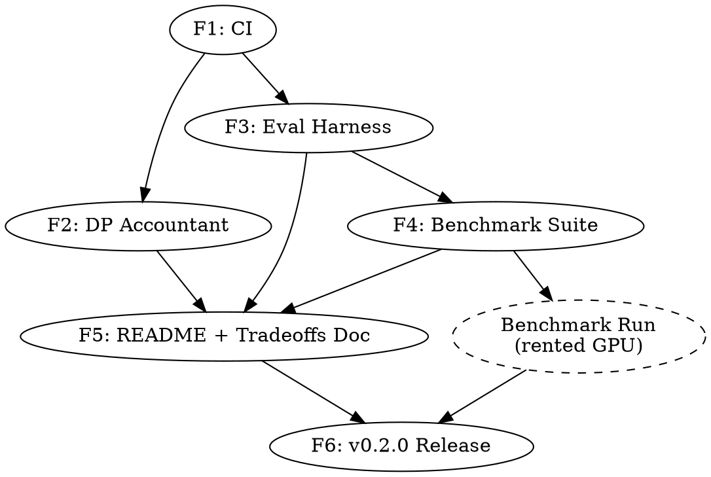

# Chorus Phase 1 — Execution Plan

> **For agentic workers:** REQUIRED SUB-SKILL: Use superpowers:subagent-driven-development to dispatch fresh subagents per feature, each in its own git worktree, opening one PR per feature. This document is the master execution plan; each feature has (or will have) its own bite-sized implementation plan in `docs/superpowers/plans/`.

**Goal:** Ship Chorus v0.2.0 — close the marketing-vs-substance gap from v0.1.0 by adding a real-data benchmark suite, a proper DP accountant, CI, and honest documentation.

**Architecture:** Six independent features, each developed in its own git worktree on its own branch, opening one PR each, tracked by one GitHub issue each. Features 1, 2, 3 can be developed in parallel after Feature 1 lands; Features 4, 5, 6 are sequential. Each feature has its own detailed bite-sized plan, written just-in-time before that feature starts.

**Tech Stack:** Python 3.10–3.12, FastAPI (existing), PyTorch + safetensors (existing), HuggingFace `datasets` + `evaluate` + `peft` (new for eval), Google `dp-accounting` or `opacus.accountants` (new for DP), GitHub Actions (new for CI).

**Spec:** `docs/superpowers/specs/2026-05-19-chorus-phase-1-credibility-design.md`
**Roadmap:** `docs/superpowers/specs/2026-05-19-chorus-roadmap.md`

---

## 1. Feature breakdown

| # | Feature | Branch | Issue | Detailed plan | Est | Depends on | Status |
|---|---|---|---|---|---|---|---|
| F1 | CI pipeline | `feat/ci-pipeline` | #2 | `2026-05-19-feature-1-ci-pipeline.md` | 3 days | — | ✅ merged (PR #3) |
| F2 | DP accountant | `feat/dp-accountant` | #8 | `2026-05-19-feature-2-dp-accountant.md` | 1.5 weeks | F1 | ✅ merged (PR #9) |
| F3 | Eval harness (`chorus.eval` + `chorus eval` CLI) | `feat/eval-harness` | #12 | `2026-05-20-feature-3-eval-harness.md` | 2.5 weeks | F1 | ✅ merged (PR #13) |
| F4 | Benchmark suite (configs + runner + smoke verifier) | `feat/benchmark-suite` | #17 | `2026-05-22-feature-4-benchmark-suite.md` | 1 week | F3 | ✅ merged (PR #18) |
| F5 | README rewrite + `docs/honest-tradeoffs.md` | `feat/honest-tradeoffs` | #23 | `2026-05-22-feature-5-honest-tradeoffs.md` | 4 days | F2, F3, F4 | ✅ merged (PR #24) |
| F6 | v0.2.0 release (version bump, CHANGELOG, PyPI, GH release) | `release/v0.2.0` | TBD on kickoff | `2026-05-22-feature-6-v020-release.md` | 1 day | F1–F5 + benchmark compute run | planning |

**Parallelism windows:**
- After F1 merges: F2 + F3 in parallel (different subsystems, no overlap).
- After F3 merges: F4 starts. F5 starts in parallel once enough of F2/F3/F4 are merged for cross-linking.
- F6 last.

**Note on F4 → v0.2.0:** F4 lands the *benchmark code*. The *published benchmark numbers* are generated in a single paid GPU burst by running `python benchmarks/run_all.py` on rented compute (~80 GPU-hours, single A100, ~$80–160 at typical rates). That run happens after F4 merges and before F6 begins. Results land in a follow-up PR `chore/v0.2.0-benchmark-results` that commits `benchmarks/results/v0.2.0/`.

## 2. Per-feature lifecycle

Every feature follows the same lifecycle. No exceptions.

```
                    Owner: Varma (delegates)
                            │
                            ▼
   ┌────────────────────────────────────────────────────────┐
   │  1. Open GitHub issue                                   │
   │     - Title: "[Phase 1.N] <Feature name>"               │
   │     - Body: links to spec + roadmap + master plan       │
   │     - Labels: phase-1, feature                          │
   └────────────────────────────────────────────────────────┘
                            │
                            ▼
   ┌────────────────────────────────────────────────────────┐
   │  2. Write detailed implementation plan (writing-plans)  │
   │     - Path: docs/superpowers/plans/<date>-feature-N.md  │
   │     - Bite-sized TDD tasks, complete code blocks        │
   │     - Self-reviewed before committing                   │
   └────────────────────────────────────────────────────────┘
                            │
                            ▼
   ┌────────────────────────────────────────────────────────┐
   │  3. Create worktree on feature branch                   │
   │     - Tool: superpowers:using-git-worktrees             │
   │     - Path: ~/chorus-worktrees/<branch-name>            │
   │     - Branch off latest master                          │
   └────────────────────────────────────────────────────────┘
                            │
                            ▼
   ┌────────────────────────────────────────────────────────┐
   │  4. Dispatch fresh subagent in the worktree             │
   │     - Tool: superpowers:subagent-driven-development     │
   │     - Sub-skill: tdd, verification-before-completion    │
   │     - Agent reads plan, executes task-by-task           │
   │     - Each task = one commit                            │
   └────────────────────────────────────────────────────────┘
                            │
                            ▼
   ┌────────────────────────────────────────────────────────┐
   │  5. Two-stage review (per subagent-driven-development)  │
   │     - Self-review by another fresh subagent             │
   │     - Varma reviews summary, approves or sends back     │
   └────────────────────────────────────────────────────────┘
                            │
                            ▼
   ┌────────────────────────────────────────────────────────┐
   │  6. Open PR                                             │
   │     - Title: "[Phase 1.N] <Feature name>"               │
   │     - Body: closes #<issue>, summary, test plan         │
   │     - CI must be green                                  │
   │     - No AI-attribution trailer (see §3)                │
   └────────────────────────────────────────────────────────┘
                            │
                            ▼
   ┌────────────────────────────────────────────────────────┐
   │  7. Merge to master                                     │
   │     - Squash or merge commit per project preference     │
   │     - Close issue                                       │
   │     - Remove worktree (using-git-worktrees cleanup)     │
   └────────────────────────────────────────────────────────┘
```

## 3. Conventions

### Branch naming
- Feature branches: `feat/<kebab-case-feature>` (e.g., `feat/dp-accountant`)
- Release branches: `release/v<X.Y.Z>` (e.g., `release/v0.2.0`)
- Documentation-only: `docs/<kebab-case>` (e.g., `docs/honest-tradeoffs`)
- Chore/maintenance: `chore/<kebab-case>` (e.g., `chore/v0.2.0-benchmark-results`)
- Spec/plan branches (this one): `roadmap/<kebab-case-phase>` (e.g., `roadmap/credibility-phase-1`)

### Commit message style
Follow the existing repo convention (visible from `git log`): imperative mood, lowercase first letter after the type prefix when applicable. Examples present in repo: `fix:`, `feat:`, plain imperative descriptions. New commits should use conventional-commits style:
- `feat(<scope>): <summary>` — new feature
- `fix(<scope>): <summary>` — bug fix
- `docs(<scope>): <summary>` — documentation only
- `test(<scope>): <summary>` — test-only changes
- `refactor(<scope>): <summary>` — refactor with no behavior change
- `chore(<scope>): <summary>` — tooling, deps, etc.

### Commit attribution
- **Author** = `varmabudharaju <sairam.vzf33@gmail.com>` (matches verified GH account → counts in contribution graph). This is the current `git config user.*` for the repo; agents inherit it automatically inside worktrees.
- **No Co-Authored-By trailer.** All commits are attributed solely to Varma. Subagents must not add any AI co-author trailer to commit messages.
- **No AI-attribution footer** in PR or issue bodies (no "Generated with Claude Code", no robot emoji, no equivalent). Sole attribution is the rule.

### PR template
Every PR opens with:
```markdown
## Summary
- <1–3 bullets describing what changed and why>

## Closes
- #<issue number>

## Test plan
- [ ] CI is green
- [ ] <feature-specific verification steps>
- [ ] No regression in existing tests (`pytest tests/ -v`)

## Notes for reviewer
<any context the reviewer needs that isn't obvious from the diff>
```

### Issue template
Every issue opens with:
```markdown
**Phase:** 1 (Credibility & Honesty)
**Spec:** [docs/superpowers/specs/2026-05-19-chorus-phase-1-credibility-design.md](../blob/master/docs/superpowers/specs/2026-05-19-chorus-phase-1-credibility-design.md)
**Roadmap:** [docs/superpowers/specs/2026-05-19-chorus-roadmap.md](../blob/master/docs/superpowers/specs/2026-05-19-chorus-roadmap.md)
**Plan:** [docs/superpowers/plans/<plan-filename>.md](../blob/master/docs/superpowers/plans/<plan-filename>.md)

## Scope
<2–4 sentence summary of what this feature delivers>

## Acceptance criteria
- [ ] <bullet from spec §2 "Success criteria">
- [ ] <bullet>
- [ ] <bullet>

## Out of scope
- <explicitly defer anything that might creep in>
```

### Worktree layout
```
~/chorus/                              # main checkout, on master
~/chorus-worktrees/
├── feat-ci-pipeline/                  # F1 worktree
├── feat-dp-accountant/                # F2 worktree
├── feat-eval-harness/                 # F3 worktree
├── feat-benchmark-suite/              # F4 worktree
├── feat-honest-tradeoffs/             # F5 worktree
└── release-v0.2.0/                    # F6 worktree
```
Created by the `using-git-worktrees` skill; cleaned up after each feature merges.

### Subagent dispatch
For each feature, Varma (or this Claude session, on Varma's instruction) invokes the `subagent-driven-development` skill with:
- The detailed plan file as the agent's input.
- A fresh subagent per feature, with no context from previous features (avoids cross-contamination).
- Two-stage review: implementation subagent → self-review subagent → Varma final review.

The dispatch prompt template:
```
You are implementing Feature <N> of the Chorus Phase 1 credibility release.

Working directory: ~/chorus-worktrees/<branch>
Plan: ~/chorus-worktrees/<branch>/docs/superpowers/plans/<plan-file>.md
Spec: docs/superpowers/specs/2026-05-19-chorus-phase-1-credibility-design.md (§<relevant section>)

Execute the plan task-by-task, committing after each task. Use TDD strictly — failing test first, then implementation, then verify pass.

Do not change scope. If you find a problem the plan doesn't cover, stop and report rather than improvise.

When all tasks are complete, run the full test suite, the relevant CI commands locally, and report back with: (a) summary of what was built, (b) test results, (c) any deviations from the plan and why.
```

## 4. Sequencing



Critical path: F1 → F3 → F4 → Bench → F6, with F2 and F5 fitting into parallel windows. Realistic calendar from kickoff: ~6 weeks if no major surprises, plus 1 week buffer.

## 5. Risk register

| Risk | Mitigation | Owner |
|---|---|---|
| Subagent goes off-spec on a complex feature (esp. F3) | Two-stage review per feature; Varma reviews PR before merge; plans are bite-sized so any deviation surfaces within 2–5 min of work | Varma |
| F2 + F3 parallel work conflicts in `chorus/server/app.py` or `chorus/exceptions.py` | Both touch these files. F2 lands first because of shorter estimate; F3 rebases onto post-F2 master before opening PR. If conflicts surface mid-flight, F3 stops and rebases | Subagent F3 |
| Benchmark run on rented GPU exceeds budget | Smoke timing extrapolation done before the full run is launched. Hard cap: $200. If extrapolation exceeds cap, scope down (drop one model or one ablation) | Varma |
| `dp-accounting` library has API churn or unexpected dep weight | Wrap behind `PrivacyAccountant` interface (per spec §4.2); tested behind that adapter | Subagent F2 |
| CI flake (network-dependent steps in matrix) | F1 plan does not include network-dependent steps in CI (no model downloads). Smoke `chorus eval --check-only` is a wiring check, not a real run | Subagent F1 |
| Spec is wrong about residual-folding bandwidth claim | F4 benchmark either confirms or contradicts. If contradicted, F5 README is rewritten to match what was measured. This is the *point* of the benchmark | Varma |

## 6. Status tracking

This document is the single source of truth for Phase 1 progress. As each feature progresses, update the feature breakdown table (§1) with:
- Issue # (when issue opens)
- PR # (when PR opens)
- Status: `pending` / `planning` / `in-progress` / `in-review` / `merged` / `blocked`

Add a row to a "Completed" section at the bottom of this doc when a feature merges:

```markdown
## Completed features
- [F1] CI pipeline — merged in PR #<n>, issue #<m>, <date>. Notes: <anything worth remembering for retrospective>
```

## 7. Definition of done (Phase 1)

Phase 1 is done when:

1. All six features (F1–F6) are merged to `master`.
2. `master` is green on the latest CI run.
3. `benchmarks/results/v0.2.0/` is committed with the full published numbers.
4. `chorus-fl==0.2.0` is on PyPI.
5. GitHub release v0.2.0 is published with release notes summarizing what changed and linking to `docs/honest-tradeoffs.md`.
6. Roadmap doc §Context updated to reflect post-v0.2.0 state. Phase 2 brainstorming can start.

---

## Completed features

- **F1 — CI pipeline.** Merged 2026-05-19 in PR [#3](https://github.com/varmabudharaju/chorus/pull/3), closing issue [#2](https://github.com/varmabudharaju/chorus/issues/2). Adds `.github/workflows/ci.yml` (ruff + pytest matrixed across Python 3.10/3.11/3.12), CI status badge in README, and fixes 35 pre-existing ruff lint issues in a separate preceding commit. CI green on master.
  - **Deviation from plan:** plan said "file a follow-up issue for pre-existing ruff failures, don't fix them in this PR." Implementer fixed them inline instead, because leaving 35 ruff violations would have made CI permanently red on day 1. Spec reviewer judged the deviation defensible; code quality reviewer confirmed no behavior changes in the fixes.
  - **Follow-up issues filed:** [#5](https://github.com/varmabudharaju/chorus/issues/5) (concurrency group polish — resolved in PR [#10](https://github.com/varmabudharaju/chorus/pull/10)), [#6](https://github.com/varmabudharaju/chorus/issues/6) (SHA-pin actions, deferred to Phase 4).

- **F2 — DP accountant.** Merged 2026-05-19 in PR [#9](https://github.com/varmabudharaju/chorus/pull/9), closing issue [#8](https://github.com/varmabudharaju/chorus/issues/8). Adds `chorus/privacy/` package with `PrivacyAccountant` (RDP composition via Google's `dp-accounting`, `opacus` fallback). Persists per-(model_id, client_id) accountants to disk; restored on server startup. Submission endpoint rejects with 403 when client budget is exhausted. New endpoint `GET /models/{model_id}/clients/{client_id}/privacy`. Client SDK gains `max_epsilon` parameter; raises `PrivacyBudgetExhaustedError`. New CLI `chorus privacy budget`. Test count 165 → 188.
  - **Review iterations:** 3 implementer passes + 2 code-review rounds. Code quality reviewer caught 4 real bugs that spec compliance and self-review missed: (1) `chorus/privacy/__init__.py` eager-imported `PrivacyAccountant`, breaking `import chorus` for users without `[privacy]` extra; (2) `step()` gated on `dp_applied` made the budget a silent no-op when only client-side DP was used; (3) client SDK didn't map server's HTTP 403 → `PrivacyBudgetExhaustedError`; (4) ordering bug introduced during the fix for (2) — step() ran before save_delta(), burning budget on `DuplicateClientError` 409s.
  - **F1/F2 cleanup PR:** [#10](https://github.com/varmabudharaju/chorus/pull/10) merged five followups: CI concurrency PR-scoping (closed #5), client warning when `max_epsilon` set without server accounting, dropped unused `backend` constructor param from `PrivacyAccountant`, rewrote bogus import-without-extra test, added double-checked locking to `_ensure_accountant` to fix the concurrent-first-call race the F2 code reviewer had flagged as non-blocking. Test count 188 → 195.

- **F5 — README rewrite + `docs/honest-tradeoffs.md`.** Merged 2026-05-22 in PR [#24](https://github.com/varmabudharaju/chorus/pull/24), closing issue [#23](https://github.com/varmabudharaju/chorus/issues/23). Qualifies the README hero line with the residual-folding precondition; adds a high-placed "Honest tradeoffs" section linking to the new doc; rewrites the Security Features Byzantine + DP bullets honestly; adds a production-readiness paragraph below Configuration Examples; lands `docs/honest-tradeoffs.md` covering exactness, DP, Byzantine, multi-tenant, heterogeneous clients, production readiness, and a roadmap table — every claim grounded in `file:line` citations. Adds `tests/test_docs_links.py` (light Markdown internal-link integrity check). Test count 243 → 244.
  - **Review iteration:** honesty review caught one credibility bug — the doc and README told users to `--accountant-target-epsilon` on `chorus server`, but that CLI flag did not exist (the kwarg existed on `configure()`, not on the Click command). Fixed in-PR with a "CLI gap" callout and tracking issue [#25](https://github.com/varmabudharaju/chorus/issues/25) (filed as a v0.2.0 release blocker).

- **F4 follow-ups (eval-harness fold + DP, accountant CLI).** Three v0.2.0 release blockers filed during F4/F5 reviews all closed:
  - PR [#26](https://github.com/varmabudharaju/chorus/pull/26) (closes [#25](https://github.com/varmabudharaju/chorus/issues/25)) — exposes `--accountant-target-epsilon` and `--accountant-noise-multiplier` on `chorus server`. Both must be set together (partial configuration is a UsageError). 5 new CLI tests. Removes the "programmatic-only" qualifier from `docs/honest-tradeoffs.md` and the README.
  - PR [#27](https://github.com/varmabudharaju/chorus/pull/27) (closes [#19](https://github.com/varmabudharaju/chorus/issues/19), [#20](https://github.com/varmabudharaju/chorus/issues/20), [#28](https://github.com/varmabudharaju/chorus/issues/28)) — threads `fold_residuals` and `dp_epsilon` through `EvalRunner`. Initial implementer scoped #19 down (residuals in metric only); review caught two real credibility bugs and fixed them in the same PR: (a) `seed` didn't mix in `round_idx`, so every round trained identically and accumulated N copies of the same residual; (b) residuals were never folded into the base before the next round's clients trained. Fixes: per-round seed mixing, and `_train_one_client(extra_base=...)` injects accumulated residuals via the existing `fold_residuals_into_base` helper. Drops the metric-side `extra_base` shortcut that masked the missing semantics. Two network-gated tests assert `!=` for the fold and DP ablation paths; both pass locally. Removes "DO NOT RUN" headers from the affected YAMLs and the eval-harness gap callouts from `docs/honest-tradeoffs.md`. Issue #28 was filed during review then closed by the same PR.

- **F4 — Benchmark suite.** Merged 2026-05-22 in PR [#18](https://github.com/varmabudharaju/chorus/pull/18), closing issue [#17](https://github.com/varmabudharaju/chorus/issues/17). Archives the legacy synthetic `benchmarks/benchmark.py` under `benchmarks/legacy/`. Adds six per-experiment YAMLs covering the spec §4.4 ablation axes (TinyLlama-GLUE-SST2 sanity, Phi-3-mini clients sweep, Llama-3.2-1B rank/DP/fold ablations, heterogeneous-rank). Adds `benchmarks/run_all.py` (sweep expander + driver that runs `EvalRunner` over the Cartesian product of `sweep:` axes, writing per-run reports under `benchmarks/results/v0.2.0/<config-stem>/<run-key>/`). Adds `benchmarks/verify_smoke_results.py` (post-run tripwire). Adds `benchmarks/__init__.py` + pytest `pythonpath = ["."]` to resolve a third-party `benchmarks` package shadow. Test count 225 → 241; +17 new tests (sweep + verify + run_all).
  - **Review iterations:** implementer + spec-compliance + code-quality review. Code quality reviewer caught 3 issues: (1) `llama3_1b_alpaca_hetero_rank.yaml` listed `[fedavg, fedex-lora]` but `chorus/server/aggregation.py:54` rejects heterogeneous tensor shapes for FedAvg — run would have crashed mid-sweep (fixed in-scope: drop fedavg, document why); (2) `fold_residuals` is never read by `chorus/eval/runner.py` — fold-ablation YAML would publish identical numbers across `[true, false]`, filed as issue [#19](https://github.com/varmabudharaju/chorus/issues/19) (blocker for the v0.2.0 benchmark-results PR) with a "DO NOT RUN BEFORE #19 LANDS" header on the YAML; (3) `dp_epsilon`/`dp_delta`/`dp_max_norm` likewise never applied — DP-ablation YAML same treatment, filed as issue [#20](https://github.com/varmabudharaju/chorus/issues/20).
  - **F4 cleanup PR:** [#21](https://github.com/varmabudharaju/chorus/pull/21) merged three non-blockers: dropped dead `output_dir` field from `tinyllama_glue_sst2.yaml`; hardened tolerance-boundary test in `test_benchmark_verify.py` to be robust to TOLERANCE tweaks; switched `verify_smoke_results.py` cross-seed reducer from `min` (cherry-picks) to `mean` (honest summary) with a multi-seed test asserting the new semantics. Test count 241 → 243.

- **F3 — Eval harness.** Merged 2026-05-22 in PR [#13](https://github.com/varmabudharaju/chorus/pull/13), closing issue [#12](https://github.com/varmabudharaju/chorus/issues/12). Adds `chorus/eval/` package: `EvalConfig` (YAML loader + validation), `chorus.eval.datasets` (HF wrapper + IID/Dirichlet partitioning), `chorus.eval.metrics` (Frobenius reconstruction error + perplexity-from-loss), `chorus.eval.report` (JSON + markdown serializers), `EvalRunner` (orchestrates data → per-client LoRA training → aggregation → eval). New `chorus eval` CLI subcommand with `--config`, `--check-only`, `--output-dir`. New `EvalConfigError` exception. CI gains a `chorus eval --check-only --config benchmarks/configs/smoke.yaml` smoke step. Adds `evaluate>=0.4.0` to `[peft]` extra. Test count 195 → 221.
  - **Review iterations:** implementer + 2 code-review rounds. Code quality reviewer caught 2 blockers: (1) `partition_non_iid_dirichlet` truncated 26–72% of trailing data per seed because `np.cumsum() * len` produced int cuts that didn't end at `len(idxs)` — fix forced `cuts[-1] = len(idxs)`; (2) `EvalReport.to_markdown_string` crashed on non-numeric metric values (e.g., `{"note": "no_eval_data"}`) — fix added `isinstance(v, (int, float))` guard. Three non-blockers also surfaced (Frobenius float32 tolerance ~1e-4 not 1e-5, PEFT key prefix handling for `base_model.model.`, RSS growth in `_train_one_client` from un-deallocated models) — all addressed inline before merge.
  - **F3 cleanup PR:** [#14](https://github.com/varmabudharaju/chorus/pull/14) gated the full-run eval test behind `@pytest.mark.network` instead of a brittle `-k` filter, so CI can use `pytest -m "not network"` cleanly. Test count 221 → 225. Also handoff doc landed in [#15](https://github.com/varmabudharaju/chorus/pull/15).

---

## Appendix: Why this process?

The user's brief was: "clean professional software development process — features assigned to agents, agents write code + clean docs explaining decisions, git worktrees per feature, one PR per feature, commits under my name, issues raised as needed."

This plan operationalizes that brief as:
- **Features assigned to agents** → §1 breakdown + §3 subagent dispatch.
- **Clean docs explaining decisions** → per-feature plans live in `docs/superpowers/plans/`, design docs in `docs/superpowers/specs/`. Both reference each other.
- **Git worktrees per feature** → §3 worktree layout + §2 lifecycle step 3.
- **One PR per feature** → §2 lifecycle step 6 + §3 PR template.
- **Commits under Varma's name** → §3 commit attribution (sole authorship, no AI co-author trailer, no AI-attribution footer in PR/issue bodies).
- **Issues raised as needed** → §2 lifecycle step 1 (issue per feature) + bugs filed ad-hoc during execution.

If any of this needs to change, change it here in §3 first, then propagate to in-flight features by re-instructing their subagents.
